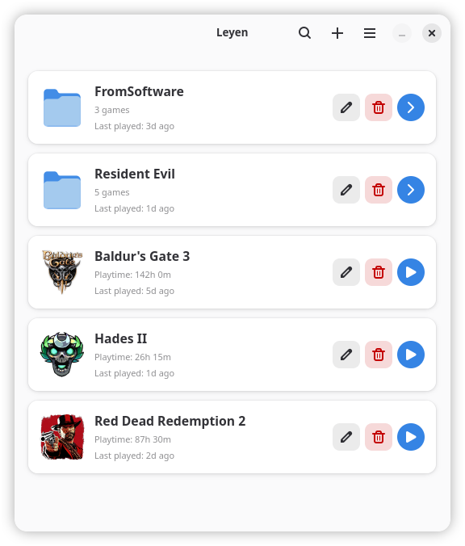
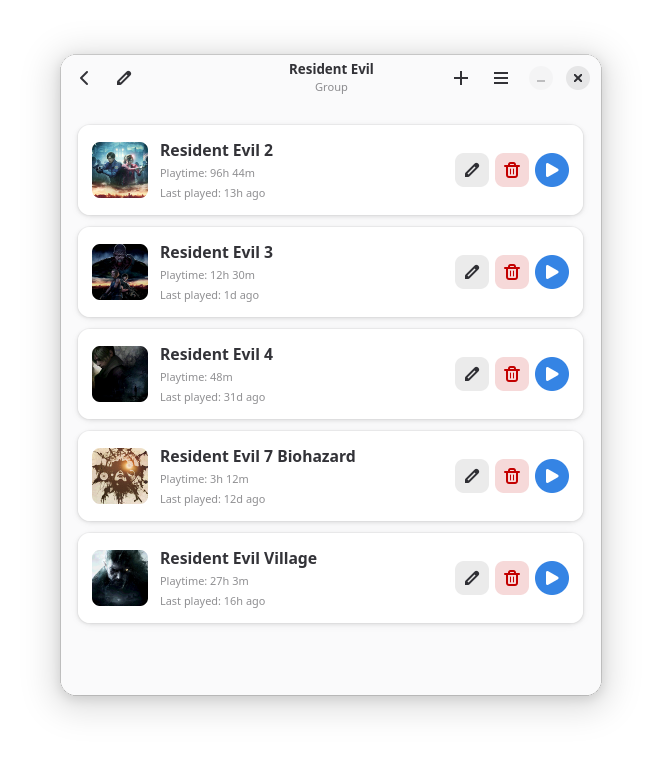

# Leyen

Leyen keeps a library of Windows games and runs them with Proton through umu-launcher,
written in Rust with GTK 4 and libadwaita. Each game gets its own Wine prefix or shares one
with its group, and a daemon on the session bus launches, tracks and stops them, so the
window, the applications menu and the command line see the same running games.

Every game runs sandboxed. It sees its prefix, its own folder and the devices it needs to
draw, play sound and read a controller; the rest of the home directory is not there, and
the session bus is replaced by a socket that reaches nothing. A machine
that cannot build the sandbox does not launch the game.

  
  

You need GTK 4.22, libadwaita 1.9, bubblewrap, a session bus and a systemd
user session.

Groups with a prefix and a Proton their games inherit, playtime and the last session of
every game, per-game launch arguments with `%command%`, MangoHud, Wayland, WoW64,
NTSync and HDR switches, the folders and the network access of each sandbox, winetricks components managed per prefix with dependencies between
them, the Wine configuration and the registry editor for any prefix, a live log for every
game, menu entries that start a game from the desktop, and `leyen list`, `run`, `kill` and
`logs` for the terminal. umu-launcher and winetricks are fetched when they are not
installed.

## Packages

Fedora 44, 45 and Rawhide, from the Copr project
[sachesi/software](https://copr.fedorainfracloud.org/coprs/sachesi/software/):

    sudo dnf copr enable sachesi/software
    sudo dnf install leyen

openSUSE Tumbleweed and Slowroll, from the OBS project
[home:sachesi:software](https://build.opensuse.org/project/show/home:sachesi:software); for
Slowroll the address has `openSUSE_Slowroll` in it, and on aarch64 `openSUSE_Factory_ARM`:

    sudo zypper addrepo https://download.opensuse.org/repositories/home:sachesi:software/openSUSE_Tumbleweed/home:sachesi:software.repo
    sudo zypper install leyen

Debian testing and Ubuntu 26.04, from the same OBS project; for Ubuntu the addresses
have `xUbuntu_26.04` in place of `Debian_Testing`:

    sudo install -d /etc/apt/keyrings
    curl -fsSL https://download.opensuse.org/repositories/home:sachesi:software/Debian_Testing/Release.key | sudo gpg --dearmor -o /etc/apt/keyrings/sachesi-software.gpg
    echo 'deb [signed-by=/etc/apt/keyrings/sachesi-software.gpg] https://download.opensuse.org/repositories/home:sachesi:software/Debian_Testing/ /' | sudo tee /etc/apt/sources.list.d/sachesi-software.list
    sudo apt update
    sudo apt install leyen

Debian 13 and Ubuntu 24.04 ship a GTK and libadwaita older than Leyen needs.

Arch Linux: the AUR package `leyen`, built from
[packaging/aur/PKGBUILD](packaging/aur/PKGBUILD), which each release tag updates.

The same packages are attached to each [release](https://github.com/sachesi/leyen/releases).

## Building and installing

    just build
    just install        # or: just prefix=$HOME/.local install

Build needs Rust 1.92, `blueprint-compiler`, `just`, gettext and the development packages for
GTK 4.22 and libadwaita 1.9. Details, other prefixes and removal are in
[docs/installing.md](docs/installing.md).

## Documentation

- [Installing](docs/installing.md)
- [Using Leyen](docs/usage.md), including [keyboard shortcuts](docs/keyboard-shortcuts.md)
- [Settings and files](docs/settings.md)
- [The command line](docs/command-line.md)
- [Troubleshooting](docs/troubleshooting.md)
- [Contributing](CONTRIBUTING.md), including where things are in the code, and
  [reporting a vulnerability](SECURITY.md)

The interface is available in English and Ukrainian.

GPL-3.0-or-later.
